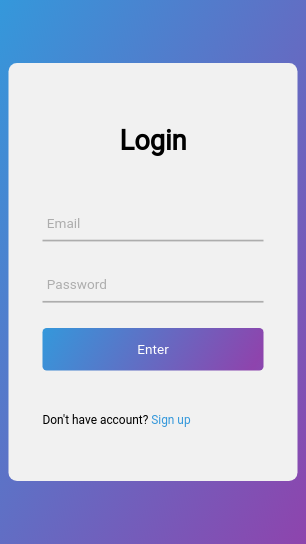
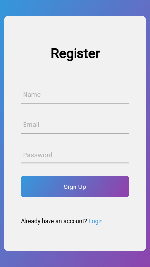
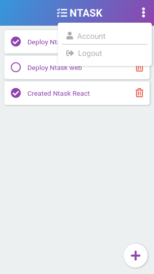
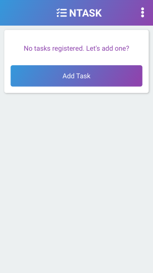
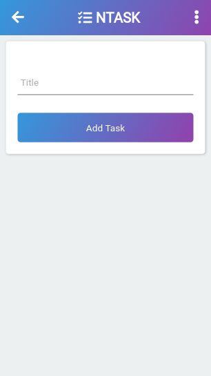
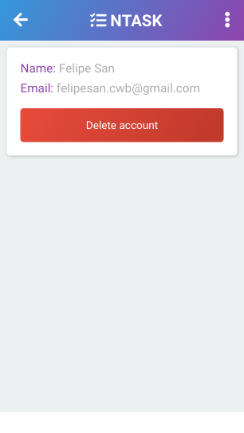

<h1 align="center">

     

</h1>

# NTask React

Task management web client that consumes an [NTask API](https://github.com/oifelipesan/ntask-api)

This is a project for educational purposes on how to create a web client using JavaScript ES6.

## Modules

- [React](https://github.com/facebook/react) - React is a JavaScript library for building user interfaces.
- [React Router](https://github.com/ReactTraining/react-router) - Declarative routing for React.
- [Styled Component](https://github.com/styled-components/styled-components) - Visual primitives for the component age.
- [React Font Awesome](https://github.com/FortAwesome/react-fontawesome) - Font Awesome 5 React component using SVG with JS

And there's more in the project [package.json](https://github.com/oifelipesan/ntask-web/blob/master/package.json).

## Installation

- Clone the repository: `git clone git@github.com:oifelipesan/ntask-react.git`
- Access the project directory: `cd ntask-react`
- Install the dependencies: `yarn install` or `npm install`
- Start: `yarn start` or `npm start`
